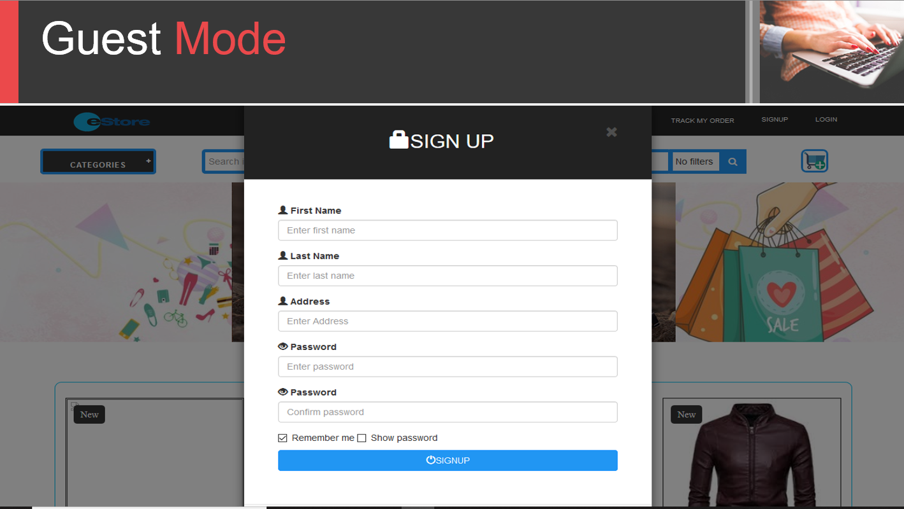
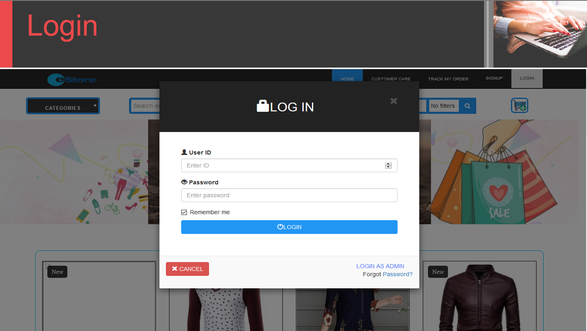
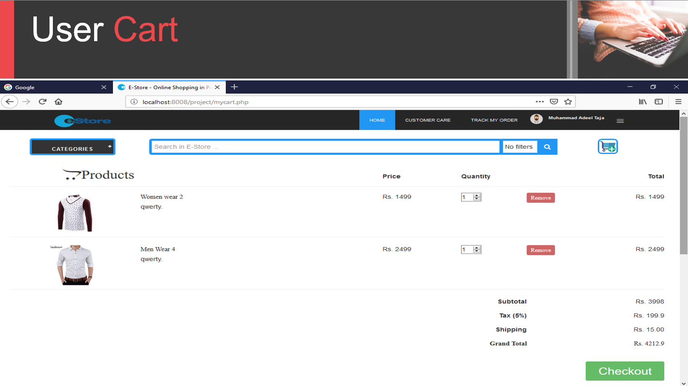
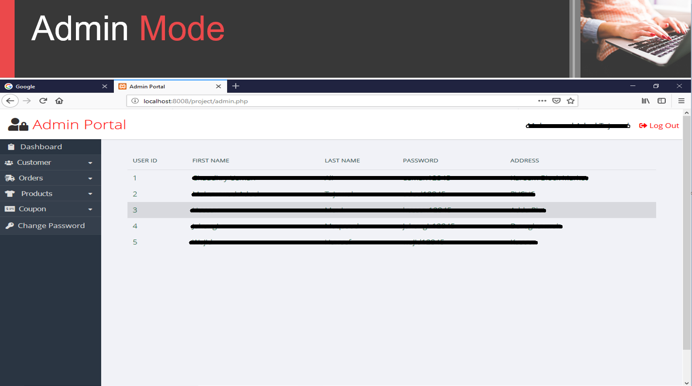

# Ecommerce-Store (ESTORE)

Estore is an Online Store Management System created as a Semester Project to explore and understand the use of databases, nosql databases in particular.

Estore is a fully responsive full stack web application. It provides all the basic functunalities of an Ecommerece store, from user authentication, admin logging, to shopping cart, shopping wallet, money coupons etc.

## Technology Stack

Estore is build using a bsic and beginner friendly tech stack compromised of:

- **HTML**
- **CSS**
- **PHP**
- **MYSQL database**
- **Boostrap**

## Estore Modes

- **User Mode**
  In User Mode mode a user can have wallet, cart and can buy products.
- **Admin Mode**
  In Admin Mode, admin can view, add, edit, delete products.
  Confrm orders etc.
- **Guest Mode**
  In Guest mode a user can view products without logging in.

## Estore Interface

## Team
- **Hassan Munir https://github.com/hsnmnr**
- **Chaudhary Usman Ali https://github.com/ch-usman-266**
- **Adeel Tajamul** http://github.com/muhammadadeeltajamul
- **Wajid Ali https://github.com/wajidravian**
- **Jahangir Maqsood https://github.com/jhangirn**
- **Talha Shafeeq**
